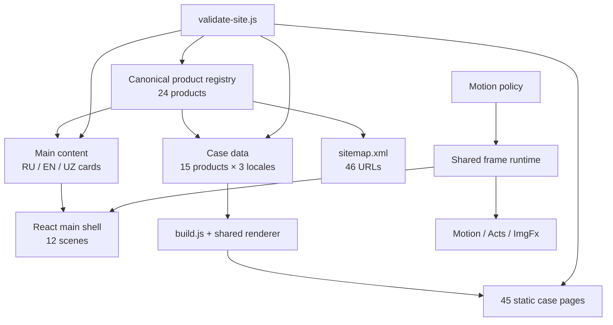

# Архитектура портфолио Samandar

Статус: описание текущего workspace, а не целевой RFC.

Runtime: статический сайт для GitHub Pages, React без модульного bundler-runtime.

Контентная модель: 24 canonical products, из них 9 live и 15 case.

Генерация кейсов: 15 routes × RU/EN/UZ = 45 статических HTML-страниц.

## 1. Границы системы

Репозиторий содержит две связанные поверхности:

1. Главная интерактивная страница с 12 сценами и 24 карточками продуктов.
2. Статически сгенерированные case pages для 15 продуктов, которые нельзя или недостаточно честно показать прямым live-переходом.

Сайт не имеет application backend, SSR, runtime transpilation, service worker или клиентского роутера общего назначения. GitHub API используется только как необязательное progressive enhancement для публичного профиля. Главная требует JavaScript и предоставляет `<noscript>`-контакты; тело каждого кейса уже находится в generated HTML до выполнения JavaScript.

## 2. Source-of-truth matrix

| Данные / поведение | Источник истины | Производные артефакты |
|---|---|---|
| product id, slug, rank, lifecycle, confidentiality, presentation, live/GitHub/case route, image, accent, evidence boundary | `src/content/product-registry.js` | карточки, metadata, sitemap, route expectations |
| тексты 12 сцен и 24 карточек на главной | `src/content/content.js` | runtime `window.CONTENT` |
| React-компоненты | `src/components/*.jsx` | соседние `*.js`, создаваемые `build.js` |
| основной набор case content | `src/projects/landings-data.js` | baked body и runtime re-render |
| три добавленных audited case definition | `src/projects/landings-new.js` | merge внутри `landings-data.js` |
| единая HTML-разметка кейса и locale UI labels | `src/projects/render.js` | 45 `projects/**/index.html` и browser re-render |
| case runtime: язык, chapter spy, reveal, image fallback | `src/projects/landing.js` | поведение уже сгенерированной страницы |
| дизайн и responsive layout | `src/styles/*.css`, `src/projects/landing.css` | computed layout в браузере |
| CSP, JSX compilation, case generation, sitemap | `build.js` | `index.html` CSP, compiled JS, case HTML, `sitemap.xml` |
| структурные инварианты | `scripts/validate-site.js` | успешная или остановленная сборка |

Generated `.js` и `projects/**/index.html` не являются местом ручного редактирования. Если нужно изменить кейс, меняются data/renderer/CSS и повторно запускается сборка.

## 3. Canonical product model

`src/content/product-registry.js` отделяет четыре независимых понятия:

- `lifecycle`: discovery, build, prototype, demo, live, production или source_incomplete;
- `confidentiality`: public, private_source, nda или sensitive;
- `presentation`: live или case;
- `portfolioState`: featured, catalog или hold.

Приватность не считается уровнем зрелости, а наличие URL не доказывает production use. `repositoryAliases`, `evidenceLevel` и `privacyBoundary` задают публично безопасную границу. `scripts/validate-site.js` проверяет уникальность id/slug/rank/routes, допустимые enum-значения, HTTPS и approved hosts, связь GitHub CTA с публичным repository alias, локали и изображения.

### 3.1 Live presentation — 9 продуктов

`klawis`, `softly`, `dostupnoe-pravo`, `helion`, `stones`, `sentinel-edge`, `cardioguard`, `izatullo`, `3d-landing`.

Primary CTA идёт на `liveUrl`. GitHub показывается вторично только если `githubUrl` разрешён реестром.

### 3.2 Case presentation — 15 маршрутов

| Slug | RU route | EN / UZ routes |
|---|---|---|
| `growthops-ai` | `/projects/growthops-ai/` | `/en/`, `/uz/` внутри route |
| `ttyl` | `/projects/ttyl/` | `/en/`, `/uz/` |
| `ai-classroom` | `/projects/ai-classroom/` | `/en/`, `/uz/` |
| `car-superapp` | `/projects/car-superapp/` | `/en/`, `/uz/` |
| `task-manager` | `/projects/task-manager/` | `/en/`, `/uz/` |
| `marketbot` | `/projects/marketbot/` | `/en/`, `/uz/` |
| `forge` | `/projects/forge/` | `/en/`, `/uz/` |
| `belfproctor` | `/projects/belfproctor/` | `/en/`, `/uz/` |
| `laplacefx` | `/projects/laplacefx/` | `/en/`, `/uz/` |
| `bioflux` | `/projects/bioflux/` | `/en/`, `/uz/` |
| `vfs-killer` | `/projects/vfs-killer/` | `/en/`, `/uz/` |
| `med-exe` | `/projects/med-exe/` | `/en/`, `/uz/` |
| `vacation-control` | `/projects/vacation-control/` | `/en/`, `/uz/` |
| `b24-sales-analyst` | `/projects/b24-sales-analyst/` | `/en/`, `/uz/` |
| `chat-app` | `/projects/chat-app/` | `/en/`, `/uz/` |

В таблице `/en/` и `/uz/` означают дочерние пути соответствующего RU route. Реальный deployment base — `/CV-Samandar/`; абсолютные canonical URL формирует `build.js`.

## 4. Главная: runtime architecture

### 4.1 Frame-zero и recovery

Порядок загрузки задаёт `index.html`:

1. `head-boot.js` выполняется parser-blocking в `<head>` и создаёт frame-zero intro до первого Hero paint.
2. CSS и core scripts preloaded с тем же asset version query.
3. В `<body>` `app-watchdog.js` ставит pre-React recovery watchdog на 5500 ms.
4. `intro.js` обогащает frame-zero shell и ждёт readiness `shell + fonts + hero`.
5. `bootstrap.js` последовательно исполняет preloaded dependency graph и делает три cooperative yield boundary.

Deep link с hash пропускает intro, чтобы прямой переход к сцене или `#proj-<slug>` не отправлял читателя сначала в начало. Head safety fallback срабатывает независимо от `requestAnimationFrame`: если shell есть, intro снимается; если shell не появился, показывается recovery surface.

### 4.2 Core dependency graph

`bootstrap.js` загружает в строгом порядке:

1. vendored React и ReactDOM;
2. product registry и main content;
3. theme, performance policy и motion runtime;
4. estimator, acts, sound, GitHub enhancement, authored motion, SceneCinema и lazy effects;
5. compiled React components и app shell.

Скрипты — обычные browser globals, не ES modules. Порядок является частью архитектурного контракта: поздние файлы используют globals ранних.

### 4.3 Двенадцать сцен

Канонический массив и фактический DOM-порядок:

`hero → signal → about → projects → builder → skills → services → cv → process → faq → trust → contact`

Hero/Signal используют нативный `position: sticky`. Services/CV и Trust/Contact находятся в `data-pin` host и получают progress из общего motion runtime. `useScrollEngine` публикует активную сцену для меню, counter, dock, acts и history; отдельные UI-поверхности не вычисляют собственную конкурирующую главу.

## 5. Build architecture

`npm run build` вызывает `node build.js`. Pipeline выполняется fail-fast:

1. source validation без требования generated files;
2. AOT JSX → JS для четырёх entry-файлов через vendored `vendor/babel.min.js` и React preset;
3. пересчёт CSP главной по точным hash всех inline data blocks;
4. генерация 15 кейсов по 3 локали — 45 HTML-файлов;
5. генерация sitemap: главная + 45 case locale URLs = 46 URL;
6. повторная validation уже с generated files и проверкой source/generated parity.

Запись выполняется только при изменении байтов. Для кратковременных Windows file locks предусмотрены ограниченные синхронные повторы; это не скрывает постоянную ошибку записи.

### 5.1 Generated case page

`render.js` — одна pure string-render функция для Node и browser runtime. Build добавляет к каждой локали:

- самостоятельные `<title>` и description;
- self-referential canonical;
- `hreflang` RU/EN/UZ/x-default;
- Open Graph и Twitter metadata;
- localized `CreativeWork` JSON-LD;
- strict CSP с точным SHA-256 hash JSON-LD;
- asset base `../../` для RU и `../../../` для EN/UZ;
- возврат на главную к `#proj-<slug>`.

После загрузки `landing.js` добавляет chapter scroll spy, сохранение hash, переход между физическими locale URL, lightweight reveal и image fallback. Основной текст уже доступен в HTML и не зависит от re-render.

## 6. I18n и URL model

### Главная

- один HTML route;
- RU — default URL без `lang`;
- EN и UZ — `?lang=en` / `?lang=uz`;
- hash сцены или карточки сохраняется при смене языка;
- `content.js` обязан иметь одинаковую структурную форму для трёх локалей.

### Кейсы

- RU, EN и UZ — разные статические URL;
- переключатель языка переносит читателя на соответствующий физический route;
- текущая глава `#thesis`, `#context`, `#system`, `#evidence` или `#boundary` сохраняется при смене языка и reload;
- locale copy и UI chrome имеют одинаковую форму, что проверяет validator.

`localStorage` кейса хранит preference, но URL остаётся shareable source текущей страницы. Restricted storage не блокирует работу.

## 7. Motion subsystem

Motion разделён на ответственности:

- `perf.js`: единственная reactive policy `window.__SM_MOTION_POLICY === window.__SM_PERF`;
- `motion-runtime.js`: единый input stream и frame scheduler `measure → compute → mutate → render`;
- `motion.js`: reveal, cursor, magnets, parallax, pin progress и coarse-pointer focus stage;
- `scene-cinema.js`: interruptible section navigation transaction;
- `acts.js`: цветовая драматургия и редкие shutter beats;
- `lazy-effects.js`: intent-loading Three.js только когда policy разрешает shader;
- `img-fx.js`: один reusable WebGL renderer без собственного RAF;
- `intro.js`: отдельная readiness-driven opening sequence.

Подробные thresholds, tier matrix, budgets и degraded paths находятся в `docs/MOTION-PERFORMANCE.md`.

## 8. Responsive architecture

Responsive contract основан не на типе устройства, а на width, height, pointer capability и motion policy:

- `<640px`: policy viewport class `phone`;
- `640–1023px`: `tablet`;
- `≥1024px`: `desktop`;
- `≤900px`: mobile shell и horizontal project gallery;
- `901–1160px`: compact desktop navigation без семи inline links, но с chapter counter;
- `>1160px`: семь primary nav links;
- `≤900px` и short landscape `≤520px`: bottom mobile dock скрыт, чтобы не перекрывать focus/content;
- case layout меняет структуру на `980px` и `700px`.

`tests/responsive-matrix.spec.js` проверяет 11 viewport-геометрий, 200% text reflow, orientation transitions, сохранение открытого menu/gallery state, отсутствие horizontal overflow и отсутствие fixed/sticky перекрытий фокуса. Это автоматический layout contract, не отчёт о ручном тесте физических устройств.

## 9. Security model

Сайт статический, но не полагается только на отсутствие backend:

- CSP по умолчанию разрешает ресурсы с `'self'`;
- executable inline JavaScript не разрешён;
- JSON-LD допускается только по точному hash;
- `style-src-elem 'self'`; inline `<style>` блокируется;
- `style-src-attr 'unsafe-inline'` оставлен для authored/generated style attributes;
- `connect-src` ограничен `'self'` и `https://api.github.com`;
- `object-src` и `frame-src` запрещены;
- `base-uri` и `form-action` ограничены `'self'`;
- внешние live URLs проходят allowlist в validator;
- private/nda/sensitive boundaries находятся в canonical registry и case copy;
- custom `404.html` является реальным noindex route, а не SPA-редиректом.

Meta CSP не содержит `upgrade-insecure-requests`: production уже обслуживается по HTTPS, а директива ломала локальный HTTP WebKit test server, переписывая относительные ресурсы в HTTPS.

## 10. Degraded states и отказоустойчивость

| Отказ | Текущее поведение |
|---|---|
| app bundle не загрузился | pre-React branded recovery с reload и Telegram |
| React render упал | ErrorBoundary с теми же полезными действиями |
| intro dependency не готова к deadline | shell раскрывается с зафиксированным fallback; отсутствие shell приводит к recovery |
| web-font не загрузился | системный fallback, intro разблокируется |
| project WebP не загрузился | branded image fallback; название и CTA остаются |
| GitHub API недоступен | статичный честный About без синтетической telemetry |
| Three.js не загрузился | обычное `` остаётся видимым |
| WebGL context потерян | effect паркуется; после restore renderer создаётся заново по следующему intent |
| tab скрыт / policy low | continuous scheduler останавливается, семантический DOM не меняется |
| View Transitions API отсутствует или завис | native/fallback scroll; hard timeout возвращает финальную сцену |

Эти paths имеют автоматические контракты в `tests/degraded.spec.js`, `tests/img-fx-lifecycle.spec.js`, `tests/scene-cinema.spec.js` и `tests/motion-lifecycle.spec.js`. Документ не утверждает проведение NVDA, VoiceOver или physical-device pass.

## 11. Verification architecture

`playwright.config.js` задаёт пять проектов:

| Проект | Viewport / устройство | Scope |
|---|---|---|
| `desktop-chromium` | `1440×1000` | основной desktop suite |
| `mobile-chromium` | Pixel 7, `412×839` | основной mobile suite |
| `mobile-webkit` | iPhone 13, `390×844` | `webkit-smoke.spec.js` |
| `desktop-firefox` | `1440×1000` | `firefox-smoke.spec.js` |
| `reduced-motion` | desktop Chromium | `reduced-motion.spec.js` |

Общий test server — `scripts/static-server.js` на `127.0.0.1:4173`. Service workers блокируются для детерминированности. На failure сохраняются trace, screenshot и video; performance suite отключает эти артефакты, потому что они искажают timing.

Ключевые команды из `package.json`:

- `npm run build` — compile + generate + validate;
- `npm run validate` — проверка source/generated contract;
- `npm test` — validate и весь Playwright suite;
- `npm run test:desktop`, `npm run test:mobile`, `npm run test:a11y`;
- `npm run test:performance` — отдельный Chromium desktop/mobile gate с одним worker;
- `npm run qa:visual` — opt-in capture 12 сцен и 15 кейсов на desktop/mobile;
- `npm run scan:secrets` и `npm run check:live` — отдельные release checks.

Наличие теста означает наличие контракта, но не означает, что он был запущен в текущем окружении. Результаты должны подтверждаться свежим test output или CI artifact, а ручные проверки — отдельным checklist.

## 12. Правила безопасного изменения

1. Изменять registry до производных карточек и кейсов.
2. Не редактировать generated JS/HTML вручную.
3. После JSX, case data, renderer, CSP или route changes запускать `npm run build`.
4. После product/locale/image changes запускать `npm run validate`.
5. Motion consumer обязан подписываться на shared runtime и освобождать subscriber/listeners/resources.
6. Декоративный failure не должен становиться application failure.
7. Новая case page обязана иметь RU/EN/UZ, canonical/hreflang, five-chapter structure, privacy boundary и возврат к точной карточке.
8. Новое утверждение о качестве сопровождается ссылкой на автоматический или явно обозначенный ручной evidence; непроведённый ручной тест не считается завершённым.
