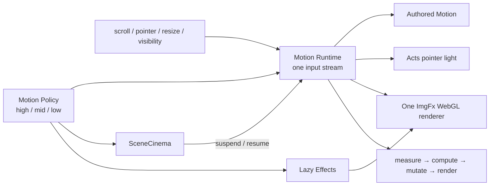

# Motion и performance architecture

Статус: фактический runtime contract.

Область: intro, 12 сцен главной, навигация, project ImgFx и case-page micro-motion.

Главный принцип: максимум выразительности в пределах реально доставляемого кадра, без потери текста, CTA, фокуса и нативного скролла.

Документ разделяет три вещи:

- runtime thresholds — точные значения из кода;
- automated budgets — точные assertions из Playwright;
- manual/device QA — внешняя проверка, которая не считается выполненной без отдельного evidence.

## 1. Source of truth

| Область | Авторитетный источник |
|---|---|
| tier-policy и frame sampler | `src/engine/perf.js` |
| единый frame scheduler/input stream | `src/engine/motion-runtime.js` |
| reveal, cursor, magnets, parallax, pin progress | `src/engine/motion.js` |
| section navigation transactions | `src/engine/scene-cinema.js` |
| project image shader lifecycle | `src/engine/lazy-effects.js`, `src/engine/img-fx.js` |
| intro timing/readiness | `src/engine/head-boot.js`, `src/engine/intro.js` |
| цветовые акты | `src/engine/acts.js` |
| CSS durations/reduced rules | `src/styles/styles.css`, `src/styles/sections.css`, `src/styles/features.css`, `src/projects/landing.css` |
| performance assertions | `tests/performance-budget.spec.js` |
| lifecycle/degraded contracts | `tests/motion-*.spec.js`, `tests/perf-policy-unit.spec.js`, `tests/scene-cinema.spec.js`, `tests/img-fx-lifecycle.spec.js`, `tests/degraded.spec.js` |

Если целевое значение в этом документе расходится с assertion, верен тест. Если описание runtime расходится с implementation, верен source file.

## 2. Общая схема

Архитектурное ограничение: consumer не создаёт собственный постоянный RAF и не дублирует глобальные `scroll`, `pointermove` или `resize` streams. Исключение — ограниченная opening sequence до монтирования приложения; после неё motion принадлежит общему runtime.

## 3. Единая motion policy

Публичный API — один объект:

`window.__SM_MOTION_POLICY === window.__SM_PERF`

Snapshot содержит:

- `tier`: `high | mid | low`;
- `reducedMotion`;
- `documentVisible`;
- `saveData`;
- `pointerClass`: `fine | coarse`;
- `viewportClass`: `phone | tablet | desktop`;
- `measuredFps`;
- `longTaskPressure`.

`getDeviceTier()` сохранён только как compatibility reader и не принимает собственных решений.

### 3.1 Начальный tier

1. `prefers-reduced-motion: reduce` или `navigator.connection.saveData` → `low`.
2. Coarse pointer → `mid`.
3. Fine pointer → `high`.

Viewport class рассчитывается отдельно и не является вторым tier-engine:

- width `<640` → `phone`;
- width `<1024` → `tablet`;
- иначе → `desktop`.

### 3.2 Capability matrix

| Tier / состояние | `allows("motion")` | `allows("shader")` | `allows("heavy")` | `shaderBudget()` |
|---|---:|---:|---:|---:|
| high | да | да | да | 2 |
| mid | да | да | нет | 1 |
| low | нет | нет | нет | 0 |
| reduced motion | нет | нет | нет | 0 |
| save-data | policy принудительно low | нет | нет | 0 |
| hidden document | нет | нет | нет | 0 |

Текущая реализация ImgFx всё равно владеет максимум одним renderer. `shaderBudget()` — общий capability contract для возможных consumers, а не утверждение, что сайт одновременно создаёт два WebGL context.

Policy публикует DOM attributes: `data-perf`, `data-motion-policy`, `data-pointer`, `data-viewport`, а также `data-motion-lite` и `data-save-data` при соответствующих состояниях.

## 4. Reactive performance governor

Hardware hints задают только стартовую гипотезу. После boot policy измеряет фактическую доставку кадров и pressure long tasks.

### 4.1 Frame thresholds

Точные значения из `perf.js`:

| Параметр | Значение |
|---|---:|
| bad frame | `>24 ms` — приблизительно ниже 42 FPS |
| good frame | `≤19.5 ms` — стабильные 51+ FPS на обычном 60 Hz display |
| sustained bad до downgrade | `900 ms` |
| sustained good до upgrade | `4200 ms` |
| settle до tier changes | `2200 ms` |
| idle до сна sampler | `5200 ms` |
| frame gap, исключаемый как resume/debugger spike | `≥500 ms` |
| sample window | до 90 frame deltas |

Диапазон `90–500 ms` не игнорируется: это реальная катастрофическая доставка, которая должна снизить tier. Upgrade/downgrade происходит по одному уровню за устойчивый сигнал. На границе `high`/`low` pressure window очищается, чтобы sampler мог уснуть.

### 4.2 Long tasks

`PerformanceObserver` учитывает entry duration `≥50 ms`. Два long task в rolling-window `5000 ms` создают pressure и понижают tier на одну ступень. Observer и adaptive sampler не запускаются в deterministic E2E test mode.

### 4.3 Wake/sleep lifecycle

Sampler просыпается на boot, scroll, pointer, resize, pointer-class, connection, visibility и явный `wake()`. Он не работает при hidden document, reduced motion или save-data и засыпает после устойчивого idle. `destroy()` снимает media/listener/observer/RAF resources.

## 5. Shared Motion Runtime

`window.__SM_MOTION_RUNTIME` объединяет события и кадры.

### 5.1 Один input snapshot

Runtime хранит scroll position/delta/velocity, pointer position/type/activity, viewport size и флаги `resized`, `scrolled`, `pointerMoved`. Глобальные listeners passive там, где это возможно.

### 5.2 Строгие фазы кадра

Каждый scheduled frame выполняет:

1. input snapshot;
2. `measure` — layout reads;
3. `compute` — чистые вычисления;
4. `mutate` — DOM writes;
5. `render` — GPU/canvas output.

Subscribers сортируются по priority. Повторно падающий декоративный subscriber после трёх ошибок отключается, а runtime публикует `sm:motion-runtime-error`; приложение и остальные effects продолжают работу.

### 5.3 Demand-driven scheduling

RAF живёт только когда runtime dirty или хотя бы один enabled subscriber просит `continuous`. При reduced motion разрешён один финальный dirty frame, но continuous scheduling прекращается. Hidden tab и явный `suspend(reason)` полностью останавливают scheduler.

SceneCinema при принятой native transition вызывает `suspend("cinema")` и обязательно `resume("cinema")` при complete, interruption, rejection, timeout, hidden-tab или dispose.

## 6. Authored motion

`motion.js` отвечает за:

- one-shot reveal и scene enter;
- smart cursor только для fine pointer;
- magnetic controls и spotlight coordinates;
- sticky/pin progress через CSS variables;
- viewport-limited parallax;
- center-stage карточки для coarse pointer;
- motion zones, чтобы далёкие сцены не продолжали декоративную работу.

Layout reads выполняются в `measure`, CSS variables и transforms — в `mutate`. Native scroll остаётся авторитетным; никакого wheel/touch hijacking нет.

`acts.js` меняет background и veil по событию активной сцены. Основной fade — `1400 ms`; внутренний reduced fallback — `150 ms`, но глобальное reduced-motion CSS-правило дополнительно сокращает effective transition duration до `0.01 ms`. Это CSS opacity/background transition, а не постоянный frame loop. Pointer light на fine pointer использует shared runtime.

## 7. SceneCinema

`SceneCinema` перехватывает только same-document anchors `href="#..."`, которые указывают на существующий element. External links, downloads, `_blank`, modified clicks и `data-no-cinema` остаются нативными.

### 7.1 Transaction contract

- каждый accepted intent получает monotonically increasing token;
- новый intent отменяет предыдущий с reason `superseded`;
- каждый `sm:cinema-start` имеет ровно один `sm:cinema-done`;
- latest intent владеет final scroll pose, active section и URL hash;
- history back/forward использует тот же navigator без новой history entry;
- hard timeout — `1800 ms`.

### 7.2 Выбор пути

Native View Transitions API используется только если он доступен и policy не reduced, не save-data, не low, а navigation не помечена `instant`.

Fallback reasons:

- `reduced-motion` — мгновенный доступный переход;
- `performance-cut` — low/save-data: прямой readable pose с коротким non-blocking spatial cue;
- `fallback` — браузер без View Transitions API;
- `timeout`, `rejected`, `start-error`, `hidden`, `superseded`, `dispose` — гарантированное завершение или освобождение transaction.

Ни один path не оставляет `is-cinema-transitioning` или runtime suspension после завершения.

## 8. Intro performance contract

Intro — readiness gate, а не симулированный loader. VERIFY ждёт `shell`, `fonts` и `hero`; истечение времени не объявляет ресурс загруженным.

### 8.1 First visit в session

| Параметр | Значение |
|---|---:|
| visual timeline | `1950 ms` |
| обычный minimum | `2400 ms` |
| minimum после user skip | `1300 ms` |
| shell-present fallback reveal | `2850 ms` |
| no-shell recovery deadline | `2750 ms` |
| reveal transition | `420 ms` |
| hold перед reveal | `90 ms` |
| skip affordance появляется | `760 ms` |

### 8.2 Repeat visit в той же session

| Параметр | Значение |
|---|---:|
| visual timeline | `1450 ms` |
| обычный minimum | `1950 ms` |
| minimum после skip | `1050 ms` |
| shell-present fallback reveal | `2250 ms` |
| no-shell recovery deadline | `2450 ms` |
| reveal transition | `330 ms` |
| hold | `60 ms` |
| skip affordance появляется | `450 ms` |

Deep links пропускают intro. Reduced mode не создаёт particle canvas и
завершает открытие opacity fade. Независимый production head safety cap —
`3800 ms`; deterministic E2E test mode проверяет ту же release-ветку с cap
`900 ms`, чтобы optional application work не мог вытеснить safety callback за
границу теста. Pre-React application watchdog — `5500 ms`.

## 9. ImgFx и optional WebGL

### 9.1 Intent loading

`lazy-effects.js` загружает `vendor/three.min.js`, а затем `img-fx.js` только после pointer/focus intent на `[data-imgfx]`, если:

- policy разрешает `shader`;
- pointer class — `fine`.

Coarse pointer, low tier, reduced motion и save-data не загружают Three.js. Ошибка optional asset возвращает `null`, не превращаясь в boot failure.

### 9.2 Finite lifecycle

ImgFx владеет:

- одним reusable `WebGLRenderer`;
- одним shared-runtime subscriber `image-shader`;
- LRU cache максимум из 6 textures;
- pixel ratio cap `2`;
- `antialias: false`, `powerPreference: "low-power"`;
- fade backstop `900 ms`.

Renderer не имеет собственного RAF. Latest host token wins: завершившаяся поздно texture load не может вернуть shader на старую карточку. Real `` всегда остаётся под canvas.

При tier downgrade, reduced/save-data, hidden document, texture error или render error effect паркуется. `webglcontextlost` предотвращает default teardown, освобождает surface и оставляет изображение; после `webglcontextrestored` renderer создаётся заново только по новому intent. `dispose()` отменяет in-flight lifecycle, очищает textures, geometry, material, renderer, canvas и subscriber.

## 10. Reduced motion

`prefers-reduced-motion: reduce` меняет способ представления, но не содержание:

- policy становится low;
- `--motion` становится `0.01`, CSS animation/transition duration принудительно сокращается до `0.01ms`;
- smooth root scroll становится auto;
- runtime выполняет максимум финальный dirty frame и не держит continuous RAF;
- SceneCinema не запускает native View Transition;
- Motion раскрывает readable final states;
- intro не создаёт canvas;
- lazy effects не загружают Three.js;
- ImgFx не активируется;
- все 26 карточек, CTA, Proof Rail, menu и disclosure semantics остаются.

Reduced motion не имеет права самостоятельно менять `aria-expanded`, выбирать ответ за пользователя или удалять semantic DOM.

## 11. Responsive motion contracts

- Fine pointer получает authored cursor, pointer light, magnets и intent-loaded ImgFx.
- Coarse pointer сохраняет section motion и горизонтальную gallery choreography, но без cursor imitation и shader download.
- При `≤900px` Projects остаётся горизонтальной scroll-snap галереей с видимым next-card peek.
- В short landscape `≤900×520` bottom dock скрыт, чтобы fixed UI не перекрывал движение и keyboard focus.
- Offscreen decorative work ограничивается IntersectionObserver/motion zones.
- Orientation и resize обновляют единый viewport snapshot; новый tier-engine не создаётся.

Автоматическая responsive sweep проверяет геометрию и focus safety, но не является замером thermal throttling на физических телефонах.

## 12. Automated performance budget

`tests/performance-budget.spec.js` запускается отдельно в desktop/mobile Chromium с `workers=1`; trace, video и screenshots отключены, чтобы не искажать измерение. Это synthetic local/CI gate, не Real User Monitoring и не лабораторный Lighthouse report.

### 12.1 Метрики и assertions

| Метрика | Desktop gate | Mobile gate | Примечание |
|---|---:|---:|---|
| intro release | `≤5500 ms + host allowance` | то же | allowance = `max(0, baseline p95 − 25) × 18` |
| LCP | `≤3800 ms` | `≤4200 ms` | должен быть `>0` |
| CLS | `≤0.10` | `≤0.10` | layout shifts без recent input |
| max long task | `≤max(1600 ms, baseline p95 × 6)` | то же | runner-normalized hard ceiling |
| total long tasks | `≤max(5200 ms, baseline p95 × 25)` | то же | сумма observed long tasks |
| max observed event duration | `≤800 ms` | `≤800 ms` | Event Timing proxy, не полный INP |
| scroll RAF p95 | `≤max(40 ms, baseline p95 × 2.5)` | `≤max(45 ms, baseline p95 × 2.5)` | 100-frame scripted native scroll |
| frames `>40 ms` | `≤8%` при baseline p95 `≤25 ms` | то же | на constrained runner допускается не более `baseline + 8 п.п.`; severe baseline (`p95 ≥50 ms` или `>20%` кадров >40 ms) либо материальная scroll-регрессия требуют tier `low` |
| JS transfer | `≤900,000 bytes` | `≤900,000 bytes` | Resource Timing |
| CSS transfer | `≤500,000 bytes` | `≤500,000 bytes` | Resource Timing |

Test attachment сохраняет baseline/scroll percentiles, tier, runtime debug, long tasks и slow resources. Aggregate image transfer записывается для диагностики, но в текущем spec не имеет отдельного assertion; нельзя документировать несуществующий image-transfer gate.

### 12.2 Asset budgets вне performance spec

`scripts/validate-site.js` отдельно ограничивает каждую project cover:

- `1536×512` ≤ `150 KB`;
- `1152×384` ≤ `100 KB`;
- `768×256` ≤ `60 KB`.

Это deterministic build contract, а не сетевой end-to-end budget.

## 13. Degraded-state matrix

| Условие | Дорогой слой | Гарантированный final state |
|---|---|---|
| policy `low` | continuous motion, shader, heavy effects | полный текст и CTA; direct scene cut |
| reduced motion | continuous animation, View Transition, Three.js | readable final states и native navigation |
| save-data | shader/heavy/continuous | та же семантика, `data-save-data` |
| hidden tab | sampler и runtime RAF | state сохраняется; active cinema transaction завершается |
| Three.js load error | ImgFx | реальный project image |
| WebGL context loss | canvas renderer | реальный image; rebuild только после restore + intent |
| texture/render error | active shader surface | surface паркуется, карточка остаётся рабочей |
| View Transition hang | cinematic transition | target/hash/active section восстанавливаются через 1800 ms |
| subscriber error ×3 | конкретный декоративный subscriber | runtime и приложение продолжают работу |
| missing IntersectionObserver | staged reveal | элементы переводятся в видимое состояние |

Деградация снимает стоимость, а не продуктовый смысл. Нельзя подменять low tier статичной пустой сценой или скрывать доказательства ради FPS.

## 14. Test coverage и честные границы

| Contract | Test source |
|---|---|
| tier API, subscription lifecycle, viewport class | `motion-policy.spec.js` |
| sampler downgrade/sleep boundaries | `perf-policy-unit.spec.js` |
| phase order, one input stream, reduced scheduling | `motion-runtime.spec.js` |
| init/dispose, subscriber/listener lifecycle | `motion-lifecycle.spec.js` |
| latest-intent, timeout, low-tier cut, history/reduced | `scene-cinema.spec.js` |
| one renderer, latest host, downgrade, context restore, in-flight dispose | `img-fx-lifecycle.spec.js` |
| missing Three.js и другие отказные пути | `degraded.spec.js` |
| desktop/mobile synthetic budget | `performance-budget.spec.js` |
| reduced content parity | `reduced-motion.spec.js` |

Playwright-конфигурация даёт основной Chromium desktop/mobile suite, отдельные WebKit/Firefox smoke и отдельный reduced-motion project. Это не доказывает:

- стабильные 40–60 FPS на каждом реальном устройстве;
- поведение при длительном thermal throttling;
- качество VoiceOver/NVDA announcement;
- battery impact;
- RUM percentiles реальных пользователей.

Такие утверждения требуют отдельного physical-device/manual/RUM evidence и не должны появляться в release notes как выполненные только на основании synthetic suite.

## 15. Правила для новых эффектов

1. Сначала определить продуктовую роль эффекта и readable final state.
2. Использовать semantic duration/easing tokens.
3. Подписаться на `__SM_MOTION_RUNTIME`; не создавать perpetual private RAF.
4. Разделить reads и writes по runtime phases.
5. Уважать policy, document visibility, pointer class и save-data.
6. Реализовать `dispose()` и отмену in-flight async work.
7. Сохранить настоящую DOM/image основу под canvas или decoration.
8. Добавить reduced, low-tier, interruption и failure contracts.
9. Проверить focus obstruction, orientation и RU/EN/UZ reflow.
10. Не ослаблять budget под конкретный slow run без доказанной host normalization или архитектурного исправления.
